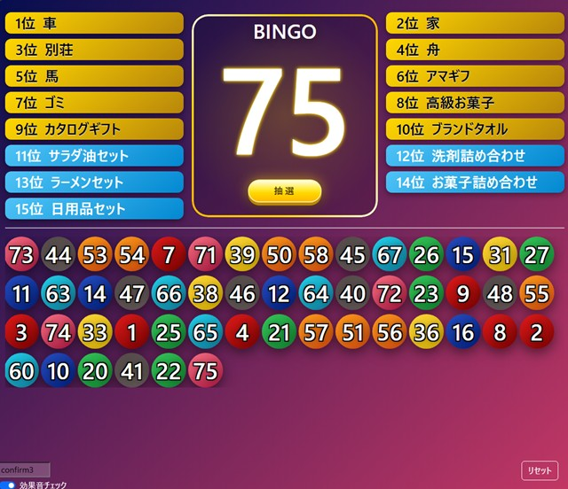

# 概要
ビンゴ抽選用のシンプルな Web アプリケーションです。 
指定した範囲の数字をランダムに抽選し、履歴として蓄積します。 
WEBサーバーを立ち上げなくてもローカルで使用できます。 
(履歴保存機能は、WEBサーバーとブラウザでHTMLファイルを直接参照の両方に対応しています)

## なぜ作ろうと思ったか
- イベントで使う様々なビンゴアプリを使ってきたが、どれも求める用途に合わなかった為

## 求める用途とは
まず前提として、参加者にとって重要なのは次の3点です。 
1. 今、何番が抽選されたか
2. 過去にどの番号が抽選されたか
3. ビンゴしたらどの景品が当たるのか
 
ビンゴゲームは、抽選結果をプロジェクターでスクリーンに映し、司会進行役がスクリーンの脇でしゃべるケースがほとんどです。 
大きな宴会場では参加者がスクリーンから離れているため、PCではよく見えてもスクリーンでは文字が小さく見づらいという問題があります。 

その為ロゴや景品の画像を画面に入れようとしても、
- 画像が場所を取りすぎる
- 景品画像はあると華やかになるがゲーム中はそこまで注目されない

という実情があります。 

景品の画像をお披露目する必要がある場合はビンゴゲームに入る前に別のタブで表示しておき、司会の方に紹介して貰う形がGoodだと思います。 
 
また、当たった場合は早い者勝ちというビンゴゲームの性質上、 
主催側が番号の履歴を元に、当選順の確認をすることもあるかもしれません。 
そうなった場合、抽選された番号の順番も分からないと確認が出来なくなってしまいます。 
1〜100までの表があって、抽選された番号が消し込まれていくタイプのアプリはこの点において致命的です。 
 
そこで、この 1〜3 を最大限わかりやすく表示できるアプリを作ろうと考えました。

# 画面サンプル

# 使い方
## アプリの起動
以下のいずれかの方法で bingo.html を開いてください。
- 同ディレクトリの bingo.html をブラウザで直接開く
file:///（ダウンロードしたパス）/bingo.html
- Web サーバー経由でアクセス

## 抽選
- 「抽選」ボタンを押すと番号がランダムに選ばれます。
- Enterキーを押しても抽選が実行されます。
- 抽選結果は cookie に保存 されるため、ページをリロードしても履歴が保持されます。

## 抽選結果のリセット
- 「リセット」ボタンを押すと抽選履歴がすべてクリアされます。

## 景品リスト
- 景品は JavaScript の配列で設定できます。
- type により表示スタイルを変更できます
- gold：目玉景品
- normal：通常景品

## 景品の強調・消し込み
- 景品名をクリックすると「当選済み」として消し込みできます。
- もう一度クリックすると「次に当てたい景品」として強調表示されます。
- 強調表示の一括リセット機能はありません。必要に応じてページをリロードしてください。

# 設定
## 抽選範囲
- ビンゴの最大値は JavaScript の定数 MAX_NUMBER を変更してください。
初期値：75（1〜75 の範囲で抽選）

## 抽選結果のレイアウト
- 抽選結果の表示列数は ./css/main.css の 
grid-template-columns を編集することで変更できます。

## 効果音
- 抽選確定時の効果音はデフォルトで confirm3.mp3 を使用しています。
- 左下のテキストボックスで効果音のmp3ファイル名を変更できます。
- 効果音を無効にしたい場合は「効果音チェック」を OFF にしてください。

## imgフォルダについて
- 本アプリではこのフォルダの内容が参照される機能はありません。
イベント前の待機中の画像や、景品の画像などを保存してください。

## BGM
BGMを流す機能はありません(追加予定もないです) 
別アプリで流す方が楽だからです。

# 使用しているフレームワーク / ライブラリ
- Bootstrap 5.3
- jQuery 3.7.1
 
これらは js フォルダ / css フォルダに同梱されています。
